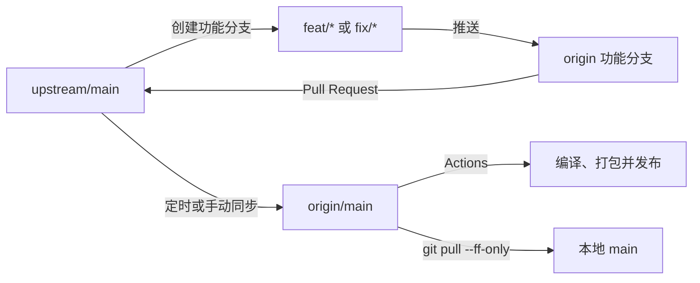

# FeatherFence 项目开发流程

本文档规定 FeatherFence 在个人仓库开发、向上游提交 Pull Request、同步上游更新以及自动构建发布时的标准流程。

## 1. 仓库和分支职责

| 名称 | 地址或来源 | 职责 |
| --- | --- | --- |
| `upstream` | `BaldwinShu/FeatherFence` | 上游官方仓库，只作为同步来源和 PR 目标 |
| `origin` | `MavisTok/FeatherFence` | 个人仓库，保存功能分支、个人主线和自动化工作流 |
| `upstream/main` | 上游主线 | 准备上游 PR 时的功能分支起点 |
| `origin/main` | 个人主线 | 接收上游同步、个人专用功能和构建工作流 |
| 本地 `main` | 跟踪 `origin/main` | 只用于更新和冲突处理，不直接开发 |
| `feat/*`、`fix/*` | 功能分支 | 准备提交给上游的修改 |
| `personal/*` | 个人功能分支 | 只在个人仓库使用、不准备提交上游的修改 |

必须遵守以下原则：

1. 不直接在本地 `main` 开发或提交普通功能。
2. 准备提交上游的功能从 `upstream/main` 创建。
3. 个人专用功能从最新 `origin/main` 创建。
4. 不向 `upstream` 推送分支；所有分支只推送到 `origin`。
5. 不使用强推或 GitHub 的 `Discard commits` 重写个人 `main`。

## 2. 整体流程



## 3. 开始一个上游功能

### 3.1 保存当前工作

先检查工作区：

```powershell
git status
```

如果当前分支有未提交修改，先创建本地提交。提交不等于推送，不会自动上传到 GitHub：

```powershell
git add <相关文件>
git commit -m "wip: 保存当前开发进度"
```

### 3.2 从最新上游创建分支

```powershell
git fetch --all --prune
git switch -c feat/<功能名称> upstream/main
```

修复类修改使用 `fix/<问题名称>`。不要从个人 `main` 或另一个尚未合并的功能分支创建上游 PR 分支，否则 PR 可能夹带个人提交或其他功能。

## 4. 开发、验证和推送

开发过程中按功能边界提交：

```powershell
git status
git add <相关文件>
git commit -m "feat: 功能说明"
```

提交 PR 前至少执行与发布工作流一致的 Release 构建：

```powershell
cargo build --release --locked
```

第一次推送功能分支：

```powershell
git push -u origin feat/<功能名称>
```

后续推送：

```powershell
git push
```

功能分支推送不会自动合入个人 `main`。阶段性推送可以作为远端备份，但本地未推送的 commit 仍会安全保留在当前分支。

## 5. 上游合并了其他 PR

获取最新上游不会修改工作区：

```powershell
git fetch upstream --prune
```

根据当前情况处理：

- 上游修改与当前功能无关：继续开发，不必反复整合。
- 当前功能依赖上游新代码：把最新 `upstream/main` 整合进功能分支。
- GitHub 显示 PR 有冲突：更新功能分支并解决冲突。
- 准备提交 PR：建议基于最新上游再完成一次构建验证。

尚未推送的功能分支优先使用变基：

```powershell
git rebase upstream/main
```

已经推送并创建 PR 的分支，为避免改写公开历史，优先使用普通合并：

```powershell
git merge upstream/main
git push
```

变基发生冲突时，解决冲突后继续：

```powershell
git add <已解决文件>
git rebase --continue
```

需要放弃本次变基时：

```powershell
git rebase --abort
```

## 6. 创建上游 Pull Request

PR 必须使用以下方向：

```text
MavisTok/FeatherFence:<功能分支>
                    ↓
BaldwinShu/FeatherFence:main
```

创建 PR 前检查文件和提交列表，确认只包含本次任务相关内容，不包含：

- 个人仓库的 Actions 工作流改动；
- 其他尚未进入上游的个人功能；
- 与本次任务无关的合并或 WIP 提交。

等待上游审核期间不要提前把功能分支合入个人 `main`。如果需要继续使用或测试该功能，可以继续停留在功能分支。

## 7. 上游合并后的自动流程

上游合并 PR 后，`.github/workflows/sync-upstream.yml` 会：

1. 每 6 小时检查一次 `upstream/main`，也支持在 Actions 页面手动运行。
2. 使用普通 `git merge` 把上游更新合入 `origin/main`。
3. 有更新时推送个人主线，并调用构建发布工作流。
4. 没有更新时正常结束，不重复构建。
5. 有合并冲突时停止，不强推、不覆盖个人提交。

`.github/workflows/release.yml` 负责 Release 构建、打包、校验和生成以及 GitHub Release 发布。普通推送或合并到 `origin/main` 也会触发该工作流。

需要立即同步时，在个人仓库打开：

```text
Actions → Sync upstream and publish → Run workflow
```

## 8. 更新本地个人主线

自动同步完成后，在需要使用个人主线时执行：

```powershell
git switch main
git pull --ff-only origin main
```

不需要提前手工比较本地和远端：

- 已经一致时，不产生修改。
- 本地落后时，安全快进到最新 `origin/main`。
- 本地 `main` 存在意外提交或历史分叉时，命令拒绝执行并要求人工处理。
- `--ff-only` 不会自动创建本地合并提交。

确认上游 PR 已合并并同步后，可以删除功能分支：

```powershell
git branch -d feat/<功能名称>
git push origin --delete feat/<功能名称>
```

删除远端功能分支是可选操作。

## 9. 个人专用功能

明确不准备提交上游的功能从个人主线创建：

```powershell
git switch main
git pull --ff-only origin main
git switch -c personal/<功能名称>
```

开发完成后推送到 `origin`，并只在个人仓库中合入 `main`。如果以后决定把该功能贡献给上游，应从最新 `upstream/main` 重新创建分支，再选择性迁移相关提交，避免把个人主线内容带入上游 PR。

## 10. 本地修改保护

远端自动同步和 GitHub Actions 运行在 GitHub runner 上，不能修改开发电脑中的文件。

- `git fetch` 只更新远端引用，不修改当前工作区。
- 已提交但未推送的 commit 不会被远端同步覆盖。
- 工作区有未提交修改时，Git 通常会拒绝可能覆盖文件的切换、合并或变基操作。
- 执行 `switch`、`pull`、`merge` 或 `rebase` 前，仍应先运行 `git status` 并提交当前进度。

除非明确知道后果，否则不要使用以下命令：

```powershell
git reset --hard
git clean -fd
```

也不要在 GitHub 的 fork 同步界面选择会丢弃个人提交的 `Discard commits`。个人仓库应使用项目自带的同步工作流。

## 11. 自动同步冲突处理

如果上游代码与个人 `main` 发生真实冲突，自动同步任务会失败并停止。人工处理流程如下：

```powershell
git switch main
git pull --ff-only origin main
git fetch upstream --prune
git merge upstream/main
```

解决冲突后：

```powershell
git add <已解决文件>
git commit
git push origin main
```

这是允许本地 `main` 产生提交的例外：用于完成上游同步冲突的合并。推送完成后会自动触发构建发布。

## 12. 快速操作清单

开始上游功能：

```powershell
git fetch --all --prune
git switch -c feat/<功能名称> upstream/main
```

开发并推送：

```powershell
git add <相关文件>
git commit -m "feat: 功能说明"
cargo build --release --locked
git push -u origin feat/<功能名称>
```

上游合并并自动同步后更新本地：

```powershell
git switch main
git pull --ff-only origin main
```

日常只需记住：上游功能从 `upstream/main` 开分支，不在本地 `main` 直接开发，上游合并后由 Actions 同步而本地只做快进更新。
